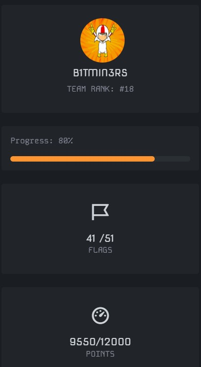

# BYPASS CTF — Writeups

Welcome to my BYPASS CTF writeup collection! 🏴‍☠️  

I participated in **BYPASS CTF**, finishing **Rank 18**, solving **41 out of 51 challenges**, and scoring **9550 / 12000 points**.  

Here you’ll find detailed, step-by-step solutions across various categories including **Forensics, Other, OSINT, Cryptography, Steganography, RevReverse Engineering, Web, and Misc**.  

Dive in and explore how each challenge was tackled from uncovering hidden codes to decoding pirate secrets!  

Happy reading, and may your flags always be captured! ⚓

